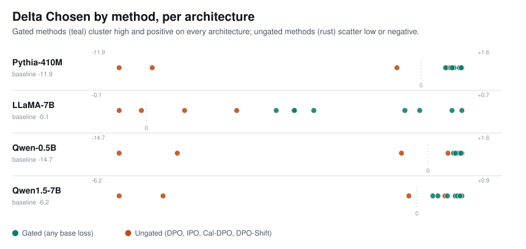

# Gate-DPO vs. the Field

**A mass-dynamics comparison of preference-optimization losses, baseline, calibrated, gated, and
globally-scheduled, measured on the same protocol, across four model architectures spanning 0.5B to 7B
parameters.**

> This repository presents a self-contained slice of results from **Gradient-Gated DPO: Stabilizing
> Preference Optimization in Language Models**, a project on mitigating the *squeezing effect* in
> off-policy DPO training, the tendency for training too long to make even the chosen response less
> likely. This repo extends the paper's results with an additional architecture (Qwen1.5-7B) and one
> further base loss (DPO-Shift) trained beyond what's in the current preprint.

**Paper:** [arXiv:2605.02626](https://arxiv.org/abs/2605.02626); 
**Interactive comparison:** [claude.ai/code/artifact/…](https://claude.ai/code/artifact/6908ffbf-7781-453f-a573-897fd7470b3c), same data, with sortable detail and a live rendering of the chart below.

## The question

When a DPO-style method reduces "squeezing" (destructive redistribution of probability mass away from
*both* chosen and rejected responses), is that because of the specific loss formulation, IPO's identity
mapping, Cal-DPO's calibration term, or because of a shared *gating* mechanism that down-weights the
rejected-response gradient once its probability is already very low?

To find out, the same gate (a smooth sigmoid threshold on the rejected response's estimated probability)
was attached to 4 different base losses, DPO, IPO, Cal-DPO, and DOP-Shift, and trained under identical
recipes on four architectures: Pythia-410M, Qwen-0.5B, LLaMA-7B, and Qwen1.5-7B.

## The finding

**The gate dominates the choice of base loss.** Gate any of DPO, IPO, DPO-Shift, or Cal-DPO with the same
valley-probability gate, and the three land within about a point of each other on every architecture,
while their ungated counterparts scatter across a much wider, mostly-negative range. A separate baseline,
DPO-Shift (a global, training-progress-scheduled coefficient rather than a per-example gate), moves the
needle only modestly off the plain DPO baseline, nowhere close to the gated cluster, on every
architecture.

Δ Chosen (change in the chosen response's log-probability from the first to the last evaluation
checkpoint) by method, per architecture:



| | Ungated range (DPO / IPO / Cal-DPO / DPO-Shift) | Gated range (any base loss) |
|---|---|---|
| Pythia-410M | −11.90 to +1.03 | +0.96 to +1.61 |
| LLaMA-7B | −0.06 to +0.19 | +0.28 to +0.68 |
| Qwen-0.5B | −14.73 to +0.96 | +1.22 to +1.62 |
| Qwen1.5-7B | −6.24 to +0.59 | +0.33 to +0.94 |

Every ungated method includes at least one strongly negative result. Every gated method, regardless of
which base loss it wraps, clusters tightly and positively.

## Intermediate results

Δ Chosen / Δ Rejected change in chosen/rejected response log-probability from first to last eval
checkpoint. A less-negative Δ Rejected means less squeezing. **Margin** = Δ Chosen − Δ Rejected. **Δ
Others** = mean change across five unrelated-example probes (spillover onto examples training shouldn't
touch).

### Pythia-410M (410M params)

DPO baseline: Δ Chosen −11.90 · Δ Rejected −26.35

| Method | Δ Chosen | Δ Rejected | Margin | Δ Others |
|---|--:|--:|--:|--:|
| DPO (baseline) | −11.90 | −26.35 | +14.45 | −27.55 |
| IPO | −0.95 | −9.43 | +8.48 | −8.55 |
| Cal-DPO | +1.03 | −6.74 | +7.77 | −3.02 |
| **Gate-IPO** (seq) | **+0.96** | −6.46 | +7.43 | −1.46 |
| **Gate-IPO** (q10) | **+1.22** | −6.69 | +7.91 | −2.76 |
| **Gate-Cal-DPO** (seq) | **+1.51** | −5.64 | +7.15 | −1.04 |
| **Gate-Cal-DPO** (q10) | **+1.61** | −5.61 | +7.22 | −2.06 |
| DPO-Shift | −10.60 | −25.40 | +14.81 | −27.85 |
| **Gate-DPO** (seq) | **+1.17** | −7.31 | +8.48 | −1.42 |
| **Gate-DPO** (q10) | **+1.30** | −7.60 | +8.90 | −3.86 |
| **Gate-DPO-Shift** (seq) | **+1.23** | −7.25 | +8.47 | −1.65 |
| **Gate-DPO-Shift** (q10) | **+1.58** | −7.29 | +8.87 | −3.37 |

### LLaMA-7B (7B params)

DPO baseline: Δ Chosen −0.06 · Δ Rejected −0.88

| Method | Δ Chosen | Δ Rejected | Margin | Δ Others |
|---|--:|--:|--:|--:|
| DPO (baseline) | −0.06 | −0.88 | +0.83 | −1.03 |
| IPO | +0.08 | −0.64 | +0.73 | −0.87 |
| Cal-DPO | +0.19 | −0.43 | +0.62 | −0.67 |
| **Gate-IPO** (seq) | **+0.32** | −0.28 | +0.59 | −0.32 |
| **Gate-IPO** (q10) | **+0.59** | +0.02 | +0.57 | −0.42 |
| **Gate-Cal-DPO** (seq) | **+0.36** | −0.22 | +0.58 | −0.32 |
| **Gate-Cal-DPO** (q10) | **+0.56** | −0.01 | +0.57 | −0.39 |
| DPO-Shift | −0.01 | −0.80 | +0.79 | −0.99 |
| **Gate-DPO** (seq) | **+0.28** | −0.41 | +0.69 | −0.38 |
| **Gate-DPO** (q10) | **+0.66** | +0.08 | +0.58 | −0.41 |
| **Gate-DPO-Shift** (seq) | **+0.32** | −0.34 | +0.66 | −0.37 |
| **Gate-DPO-Shift** (q10) | **+0.68** | +0.10 | +0.58 | −0.40 |

### Qwen-0.5B

DPO baseline: Δ Chosen −14.73 · Δ Rejected −30.47

| Method | Δ Chosen | Δ Rejected | Margin | Δ Others |
|---|--:|--:|--:|--:|
| DPO (baseline) | −14.73 | −30.47 | +15.74 | −31.47 |
| IPO | −1.26 | −8.36 | +7.10 | −6.39 |
| Cal-DPO | +0.96 | −6.03 | +6.98 | −3.19 |
| **Gate-IPO** (seq) | **+1.22** | −5.60 | +6.82 | −1.00 |
| **Gate-IPO** (q10) | **+1.45** | −5.61 | +7.06 | −2.08 |
| **Gate-Cal-DPO** (seq) | **+1.48** | −4.94 | +6.42 | −0.85 |
| **Gate-Cal-DPO** (q10) | **+1.62** | −4.88 | +6.50 | −1.94 |
| DPO-Shift | −11.96 | −27.23 | +15.27 | −28.43 |
| **Gate-DPO** (seq) | **+1.23** | −6.37 | +7.60 | −1.00 |
| **Gate-DPO** (q10) | **+1.47** | −6.25 | +7.72 | −2.72 |
| **Gate-DPO-Shift** (seq) | **+1.32** | −6.17 | +7.49 | −0.81 |
| **Gate-DPO-Shift** (q10) | **+1.57** | −6.00 | +7.57 | −2.41 |

### Qwen1.5-7B

DPO baseline: Δ Chosen −6.24 · Δ Rejected −10.45

| Method | Δ Chosen | Δ Rejected | Margin | Δ Others |
|---|--:|--:|--:|--:|
| DPO (baseline) | −6.24 | −10.45 | +4.21 | −13.48 |
| IPO | −0.17 | −2.16 | +1.99 | −2.71 |
| Cal-DPO | +0.59 | −1.07 | +1.66 | −1.31 |
| **Gate-IPO** (seq) | **+0.64** | −1.02 | +1.66 | −0.80 |
| **Gate-IPO** (q10) | **+0.82** | −0.75 | +1.58 | −1.18 |
| **Gate-Cal-DPO** (seq) | **+0.80** | −0.71 | +1.51 | −0.49 |
| **Gate-Cal-DPO** (q10) | **+0.94** | −0.52 | +1.46 | −0.81 |
| DPO-Shift | −5.32 | −9.20 | +3.88 | −11.80 |
| **Gate-DPO** (seq) | **+0.33** | −1.58 | +1.92 | −1.65 |
| **Gate-DPO** (q10) | **+0.85** | −0.77 | +1.62 | −1.39 |
| **Gate-DPO-Shift** (seq) | **+0.44** | −1.41 | +1.85 | −1.43 |
| **Gate-DPO-Shift** (q10) | **+0.90** | −0.71 | +1.62 | −1.29 |

## A note on the Cal-DPO calibration term

An earlier version of this comparison trained Cal-DPO and Gate-Cal-DPO with β = 0.001 for the calibration
term, implying a target reward gap c = 1/(2β) = 500 — far outside the range the method is designed for,
and the source of training-time calibration losses on the order of 10⁵ with gradient norms in the
millions on every architecture. That was a bug in the hyperparameter choice, not a property of the
method or an architecture-specific instability: the original Cal-DPO formulation uses β = 0.1, giving a
sane target c = 1/(2β) = 5.0. All Cal-DPO and Gate-Cal-DPO checkpoints were retrained with the corrected
β, and every number in this repository, including the strip chart, reflects that fix.

## Method
Read our **Paper:** [arXiv:2605.02626](https://arxiv.org/abs/2605.02626) for full details and final results.

- **Protocol**: for each configuration, an SFT-warmed policy is trained with the given preference loss for
  5 epochs on 5,001 examples (Anthropic-HH, helpful-base split), with periodic evaluation checkpoints
  recording log-probabilities on the chosen response, the rejected response, and five held-out "unrelated
  example" probes.
- **Gate**: a smooth sigmoid `g(p) = σ(α · (p − τ))` applied to the rejected-term gradient, where `p` is an
  estimate of the rejected response's probability (either a token-level quantile, "q10", or a
  sequence-level geometric mean, "seq"). The gate is detached from the computation graph, so it acts as a
  per-example reweighting rather than introducing a new gradient path.
- **Architectures**: Pythia-410M, Qwen-0.5B, LLaMA-7B, Qwen1.5-7B — spanning roughly an order of magnitude
  in parameter count, on both a purpose-built decoder-only model (Pythia) and two independently-trained
  model families (Qwen, LLaMA).
- **Compute**: all runs trained on a single A100-80GB per job via [Modal](https://modal.com).

## Citation

```bibtex
@misc{mouiche2026gatedpo,
  title  = {Gradient-Gated DPO: Stabilizing Preference Optimization in Language Models},
  author = {Mouiche and Bahi},
  year   = {2026},
  eprint = {2605.02626},
  archivePrefix = {arXiv},
  url    = {https://arxiv.org/abs/2605.02626}
}
```

---

*Results current as of October 2026.* Code and full experimental infrastructure available on request.
